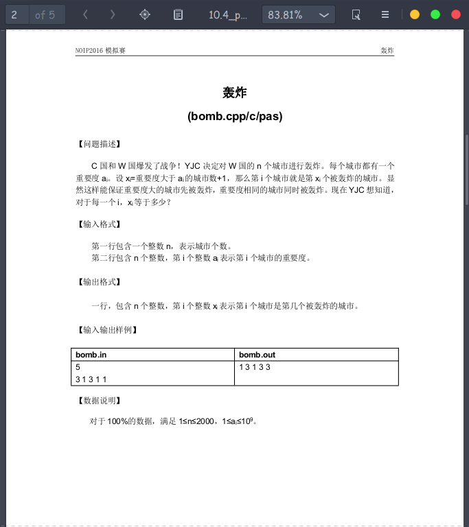
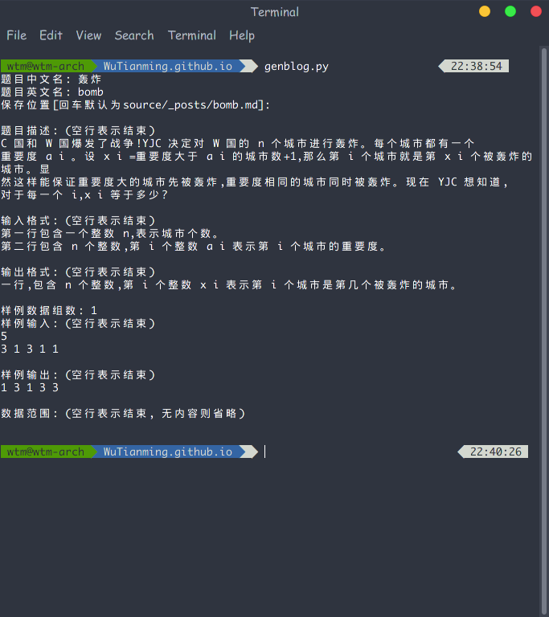
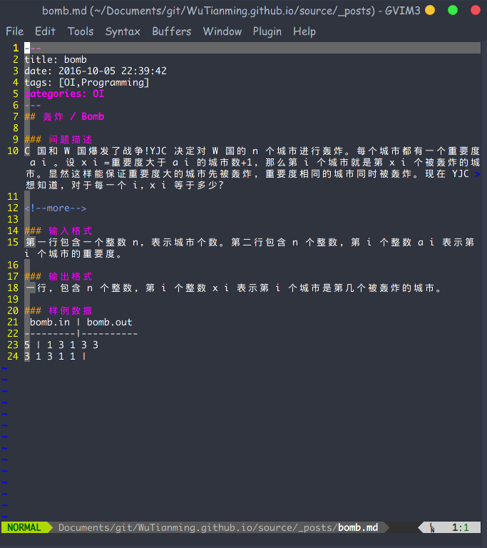
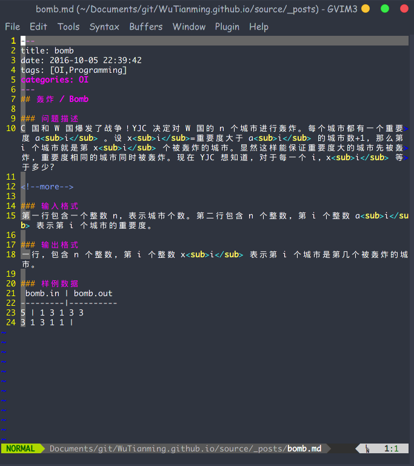
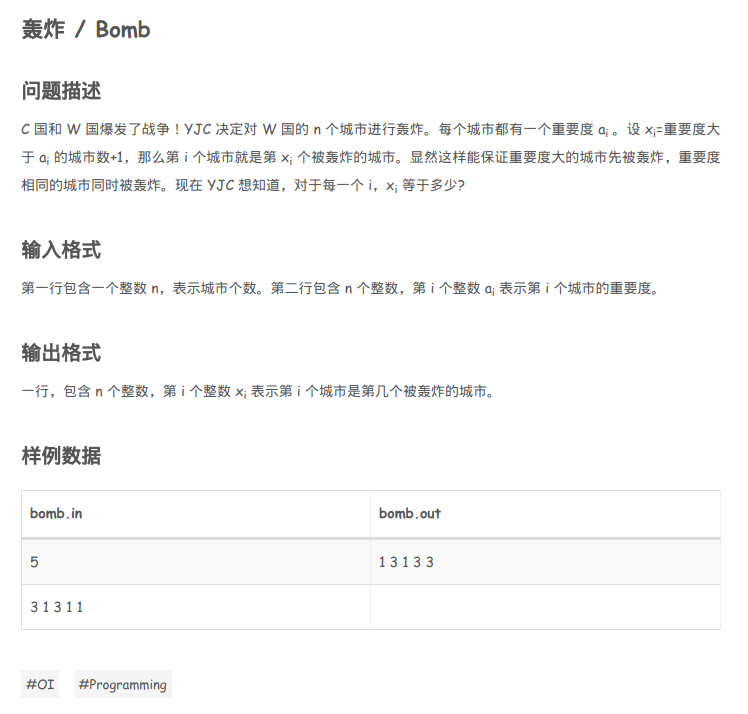

# GenOIBlog
根据OI题目创建Markdown博客，给Hexo用。

不要以为这个可以读取PDF啥的。那么高级的我不会。我做的只是读进题目，加Header和Banner，然后写进文件。

## 正确使用方法：运行`genblog.py`，填写题目信息，然后大片复制粘贴。

## 以下是示例。
### 1. 打开题目。

### 2. 在博客目录下运行脚本，并且从题目中复制粘贴以下内容。

> 注意，在打数据范围的时候我手滑回车了...
> 大家会注意到，PDF里复制下来会莫名其妙地换行，而且中文标点全部变成英文标点（除了句号和顿号），所以我做了点手脚，把换行符全删掉了，替换了逗号。实际上这个完全无法满足需求，所以必须得后期修整。

### 3. 生成完毕，查看结果。可以发现，下标什么的全部乱掉了。

### 4. 后期修整。其实这是最重要的一步。:joy:我添加了一些（一大堆）html代码来使得下标显示正确。

### 5. [最终网页渲染结果](http://wutianming.coding.me/2016/10/05/bomb/)：

Done.
